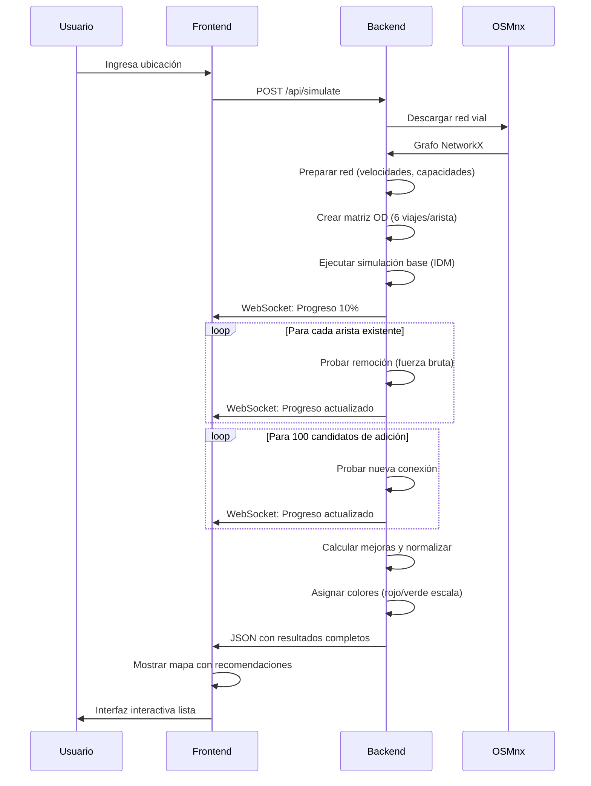

# 🚦 Detector de Paradoja de Braess - Sistema de Simulación y Optimización de Redes Viales

## 📖 Tabla de Contenidos
- [🎯 Introducción](#introducción)
- [✨ Características Principales](#características-principales)
- [⚙️ Instalación Rápida](#instalación-rápida)
- [🚀 Guía de Uso](#guía-de-uso)
- [📁 Análisis de Archivos del Proyecto](#análisis-de-archivos-del-proyecto)
- [🔬 Arquitectura del Sistema](#arquitectura-del-sistema)
- [📊 Interpretación de Resultados](#interpretación-de-resultados)
- [🧠 Fundamentos Teóricos](#fundamentos-teóricos)
- [⚡ Optimización y Rendimiento](#optimización-y-rendimiento)
- [⚠️ Limitaciones y Trabajo Futuro](#limitaciones-y-trabajo-futuro)
- [📚 Referencias](#referencias)

---

## 🎯 Introducción

### ¿Qué es la Paradoja de Braess?

La **Paradoja de Braess** es un fenómeno contraintuitivo en teoría de redes donde **agregar capacidad adicional a una red puede empeorar el rendimiento general**. En el contexto del tráfico vehicular:

- **Caso típico**: Se construye una nueva carretera para aliviar la congestión
- **Resultado paradójico**: El tiempo de viaje promedio aumenta para todos
- **Razón**: Los conductores egoístas optimizan sus rutas individuales, creando un equilibrio de Nash subóptimo

### Objetivo del Proyecto

Este sistema es un **simulador de tráfico microscópico** que:

1. **Descarga** redes viales reales de OpenStreetMap
2. **Simula** el comportamiento de vehículos individuales usando el modelo IDM (Intelligent Driver Model)
3. **Analiza** todas las aristas (calles) de la red para detectar paradojas de Braess
4. **Recomienda** qué calles remover o agregar para mejorar el flujo de tráfico
5. **Visualiza** las recomendaciones en un mapa interactivo con colores según su impacto

---

## ✨ Características Principales

### 🎨 Interfaz de Usuario
- **Tres paneles**: Controles, Mapa, Resultados
- **Responsive**: Adaptable a dispositivos móviles y de escritorio
- **Visualización interactiva**: Mapa Leaflet con zoom y popups informativos
- **Código de colores**: Normalización visual del impacto de recomendaciones

### ⚡ Rendimiento
- **Aceleración GPU**: Soporte opcional con CuPy (10-100x más rápido)
- **WebSockets**: Actualizaciones en tiempo real del progreso
- **Algoritmos optimizados**: Muestreo inteligente para análisis de grandes redes
- **Exportación múltiple**: GeoJSON, CSV y GraphML

### 🔍 Análisis Completo
- **Modelo IDM**: Simulación microscópica realista
- **Fuerza bruta**: Prueba todas las remociones posibles
- **Muestreo espacial**: Encuentra conexiones beneficiosas
- **Múltiples métricas**: Tiempo de viaje, distancia recorrida, viajes completados

---

## ⚙️ Instalación Rápida

### Requisitos del Sistema
- **Python 3.8+** (recomendado 3.11)
- **Navegador web moderno** (Chrome, Firefox, Edge)
- **Conexión a Internet** (para descargar mapas de OpenStreetMap)
- **Opcional**: GPU NVIDIA para aceleración con CuPy

### Instalación Paso a Paso

```bash
# 1. Clonar el repositorio
git clone https://github.com/thanospower007/Braess_paradox_Detector.git
cd braess-paradox-detector

# 2. Crear entorno virtual (recomendado)
python -m venv venv

# 3. Activar entorno virtual
# Windows:
venv\Scripts\activate
# Linux/Mac:
source venv/bin/activate

# 4. Instalar dependencias
pip install numpy scipy pandas geopandas networkx osmnx shapely flask flask-socketio python-socketio eventlet

# 5. Opcional: Aceleración GPU (requiere NVIDIA GPU)
pip install cupy-cuda11x
```

### Verificación de Instalación

```bash
python -c "import osmnx; import flask; import networkx; print('✅ Instalación exitosa')"
```

---

## 🚀 Guía de Uso

### Ejecución del Sistema

```bash
# 1. Navegar a la carpeta del proyecto
cd Braess_paradox_Detector

# 2. Activar entorno virtual
# Windows:
venv\Scripts\activate
# Linux/Mac:
source venv/bin/activate

# 3. Ejecutar el servidor
python backend.py

# 4. Abrir navegador en:
http://localhost:5000
```

### Ubicaciones Recomendadas para Pruebas

Para resultados rápidos (1-5 minutos), usa áreas pequeñas:

#### 🇨🇴 Colombia (Rápido)
- `"Guatapé, Antioquia, Colombia"` (muy rápido, ~50 nodos)
- `"La Candelaria, Bogotá, Colombia"` (rápido, ~150 nodos)
- `"Barrio Colombia, Medellín, Colombia"`

#### 🌎 Internacional (Rápido)
- `"SoHo, Manhattan, New York, USA"`
- `"Barrio Gótico, Barcelona, España"`
- `"San Telmo, Buenos Aires, Argentina"`

### Flujo de Trabajo Típico

1. **Ingresar ubicación** en el panel izquierdo
2. **Click en "Ejecutar Simulación"**
3. **Observar progreso** en la barra y mensajes
4. **Analizar resultados** en el mapa y paneles
5. **Exportar** recomendaciones en el formato deseado

### Interpretación de Colores en el Mapa

#### 🔴 Recomendaciones de REMOCIÓN:
- **Rojo (#e53e3e)**: Alto impacto (66.6%-100%)
- **Naranja (#f97316)**: Impacto medio (33.3%-66.6%)
- **Azul (#3b82f6)**: Bajo impacto (0%-33.3%)

#### 🟢 Recomendaciones de ADICIÓN:
- **Verde (#38a169)**: Alto impacto (66.6%-100%)
- **Amarillo (#eab308)**: Impacto medio (33.3%-66.6%)
- **Morado (#a855f7)**: Bajo impacto (0%-33.3%)

---

## 📁 Análisis de Archivos del Proyecto

### backend.py (896 líneas) - Cerebro del Sistema

#### Sección Clave: Detección de GPU (Líneas 1-63)
```python
try:
    import cupy as cp
    np = cp  # Reemplazar NumPy por CuPy
    logger.info("Usando CuPy para aceleración por GPU. ✅")
    USE_CUPY = True
except ImportError:
    import numpy as np
    logger.warning("CuPy no encontrado. Volviendo a NumPy (CPU).")
    USE_CUPY = False
```

**Innovación**: Detección automática de GPU, permitiendo aceleración 10-100x sin cambios de código.

#### Clase Microsimulator (Líneas 116-327)

Implementa el modelo IDM (Intelligent Driver Model):

```python
class Microsimulator:
    def __init__(self, G, od_pairs, reactive_ratio=0.3, duration_minutes=10, dt=1.0):
        # Inicialización de estructuras de datos
        self.edge_vehicles = {}      # Diccionario: arista → lista de vehículos
        self.edge_congestion = {}    # Diccionario: arista → nivel de congestión
        
    def calculate_desired_speed(self, vehicle):
        # Implementación del modelo IDM
        # dv/dt = a [1 - (v/v₀)⁴ - (s*/s)²]
```

**Parámetros del modelo IDM**:
- `T = 1.5 s`: Tiempo de reacción
- `a = 1.0 m/s²`: Aceleración máxima
- `b = 1.5 m/s²`: Desaceleración confortable
- `s₀ = 2.0 m`: Distancia mínima entre vehículos

#### Algoritmo de Análisis (Líneas 399-623)

```python
def run_simulation(G, duration_minutes=10, reactive_ratio=0.3):
    # 1. Simulación base (estado actual)
    sim_base = Microsimulator(G, od_pairs)
    base_results = sim_base.run()
    
    # 2. Fuerza bruta: prueba remoción de cada arista
    for edge_key in G.edges(keys=True):
        G_mod = G.copy()
        G_mod.remove_edge(*edge_key)
        # Evaluar impacto...
    
    # 3. Muestreo: prueba adición de conexiones estratégicas
    candidate_edges = get_candidate_addition_edges(G, max_distance=400)
    for (u, v) in candidate_edges:
        # Evaluar beneficio...
    
    # 4. Normalización y asignación de colores
    impacts = [r['impact_pct'] for r in recommendations]
    normalized = (impact - min_impact) / (max_impact - min_impact)
```

#### Endpoints REST (Líneas 706-860)

```python
@app.route('/api/simulate', methods=['POST'])
def simulate():
    # Descarga red OSM + simulación completa
    return jsonify({'success': True, 'results': ..., 'recommendations': ...})

@app.route('/api/export/<format_type>')
def export_results(format_type):
    # Exportación en múltiples formatos
    # format_type ∈ {'geojson', 'csv', 'modified_graph'}
```

### app.js (393 líneas) - Lógica del Frontend

#### Inicialización y WebSockets

```javascript
// Conexión en tiempo real para actualizaciones de progreso
function connectWebSocket() {
    socket = io();
    socket.on('simulation_update', data => updateProgress(data));
    // Formato: {step: 150, total_steps: 600, status: "..."}
}

// Actualización visual del progreso
function updateProgress(data) {
    const progress = (data.step / data.total_steps) * 100;
    document.getElementById('progress-fill').style.width = `${progress}%`;
}
```

#### Visualización en Mapa

```javascript
function displayRecommendationsOnMap(recommendations) {
    recommendations.forEach(rec => {
        // Usar color asignado por backend (normalizado)
        const polyline = L.polyline(latLons, {
            color: rec.color || '#808080',
            weight: 6,
            opacity: 0.9,
            dashArray: (rec.action === 'add') ? '10, 10' : null
        });
        
        // Popup interactivo con detalles
        polyline.bindPopup(`
            <b>Acción: ${rec.action}</b><br>
            Impacto: ${rec.impact_pct.toFixed(1)}%<br>
            Justificación: ${rec.justification}
        `);
    });
}
```

### index.html (115 líneas) - Estructura de la Interfaz

**Diseño de tres paneles con CSS Grid**:
```html
<div class="main-content">
    <div class="controls-panel">   <!-- Izquierda: Controles -->
    <div class="map-container">    <!-- Centro: Mapa -->
    <div class="results-panel">    <!-- Derecha: Resultados -->
</div>
```

**Responsive design**:
```css
@media (max-width: 1200px) {
    .main-content { grid-template-columns: 1fr 400px; }
}
@media (max-width: 768px) {
    .main-content { grid-template-columns: 1fr; }
}
```

### styles.css (286 líneas) - Sistema de Diseño

**Paleta de colores científica**:
```css
/* Colores para recomendaciones de REMOCIÓN */
.remove-high { color: #e53e3e; }   /* Rojo - Alto impacto */
.remove-medium { color: #f97316; } /* Naranja - Medio impacto */
.remove-low { color: #3b82f6; }    /* Azul - Bajo impacto */

/* Colores para recomendaciones de ADICIÓN */
.add-high { color: #38a169; }      /* Verde - Alto impacto */
.add-medium { color: #eab308; }    /* Amarillo - Medio impacto */
.add-low { color: #a855f7; }       /* Morado - Bajo impacto */
```

---

## 🔬 Arquitectura del Sistema

### Diagrama de Componentes

```
┌─────────────────────────────────────────────────────────────┐
│                        USUARIO                              │
└────────────────────────┬────────────────────────────────────┘
                         │ HTTP/WebSocket
                         ▼
┌─────────────────────────────────────────────────────────────┐
│                   FRONTEND (Navegador)                      │
│  ┌──────────────┐  ┌──────────────┐  ┌──────────────┐     │
│  │  index.html  │  │   app.js     │  │  styles.css  │     │
│  │  (Vista)     │  │  (Control)   │  │  (Estilo)    │     │
│  └──────────────┘  └──────────────┘  └──────────────┘     │
└────────────────────────┬────────────────────────────────────┘
                         │ API REST
                         ▼
┌─────────────────────────────────────────────────────────────┐
│                   BACKEND (Python/Flask)                    │
│  ┌──────────────────────────────────────────────────────┐  │
│  │                    backend.py                        │  │
│  │  ┌────────────┐  ┌────────────┐  ┌────────────┐    │  │
│  │  │   Flask    │  │  OSMnx     │  │ Simulador  │    │  │
│  │  │ (Servidor) │  │ (Mapas)    │  │ (Tráfico)  │    │  │
│  │  └────────────┘  └────────────┘  └────────────┘    │  │
│  └──────────────────────────────────────────────────────┘  │
└────────────────────────┬────────────────────────────────────┘
                         │
                         ▼
┌─────────────────────────────────────────────────────────────┐
│                  SERVICIOS EXTERNOS                         │
│  ┌──────────────┐  ┌──────────────┐                        │
│  │ OpenStreetMap│  │   Leaflet    │                        │
│  │  (Datos)     │  │   (Mapas)    │                        │
│  └──────────────┘  └──────────────┘                        │
└─────────────────────────────────────────────────────────────┘
```

### Flujo de Datos Completo



---

## 📊 Interpretación de Resultados

### Métricas Clave

| Métrica | Descripción | Fórmula | Interpretación |
|---------|-------------|---------|----------------|
| **TTT** | Tiempo Total de Viaje | Σ(tiempoᵢ) | Menor es mejor |
| **ATT** | Tiempo Promedio de Viaje | TTT / viajes | Menor es mejor |
| **VMT** | Distancia Total Recorrida | Σ(distanciaᵢ) | Menor es mejor |
| **CT** | Viajes Completados | # viajes terminados | Mayor es mejor |

### Cálculo de Mejora

```python
# Para métricas de costo (TTT, ATT, VMT)
mejora = (1 - valor_modificado / valor_base) × 100

# Para métricas de beneficio (CT)
mejora = (valor_modificado / valor_base - 1) × 100

# Mejora promedio (las 4 métricas)
mejora_promedio = (mejora_TTT + mejora_ATT + mejora_VMT + mejora_CT) / 4
```

### Normalización Min-Max

```python
# Todas las recomendaciones se normalizan para comparación justa
score_normalizado = (impactoᵢ - impacto_mín) / (impacto_máx - impacto_mín)

# Categorización:
if score_normalizado < 0.333: categoria = 'bajo'
elif score_normalizado < 0.666: categoria = 'medio'
else: categoria = 'alto'
```

### Ejemplo Práctico

```
Base (red actual):
  TTT = 50,000 s, ATT = 250 s, VMT = 100,000 m, CT = 200 viajes

Remover "Calle 80":
  TTT = 45,000 s, ATT = 225 s, VMT = 95,000 m, CT = 200 viajes

Cálculos:
  Mejora TTT: (1 - 45000/50000)×100 = 10%
  Mejora ATT: (1 - 225/250)×100 = 10%
  Mejora VMT: (1 - 95000/100000)×100 = 5%
  Mejora CT: (200/200 - 1)×100 = 0%
  
  Mejora promedio: (10+10+5+0)/4 = 6.25%
  
  Si mejoras van de 2% a 20%:
  Score normalizado: (6.25-2)/(20-2) = 0.236 → CATEGORÍA "BAJO"
  Color asignado: Azul (#3b82f6) para remoción
```

---

## 🧠 Fundamentos Teóricos

### Paradoja de Braess Formalmente

**Teorema**: En una red de flujo con usuarios egoístas que minimizan su costo individual, agregar un enlace puede aumentar el costo total del sistema en equilibrio de Nash.

**Ejemplo Matemático**:
```
Red original:
  A → B: costo = x (flujo-dependiente)
  A → C: costo = 45 (constante)
  B → D: costo = 45 (constante)
  C → D: costo = x (flujo-dependiente)

Equilibrio: 50% toma A→B→D, 50% toma A→C→D
Costo promedio: 1.5 horas

Agregar enlace B→C con costo 0:
Nuevo equilibrio: Todos toman A→B→C→D
Costo promedio: 2 horas (¡25% PEOR!)
```

### Modelo IDM (Intelligent Driver Model)

**Ecuación fundamental**:
```
dv/dt = a [1 - (v/v₀)⁴ - (s*/s)²]

Donde:
  v: velocidad actual (m/s)
  v₀: velocidad deseada (m/s)
  a: aceleración máxima (m/s²)
  s: distancia al vehículo adelante (m)
  s*: distancia deseada (m)

s* = s₀ + vT + (vΔv)/(2√(ab))

Parámetros usados:
  T = 1.5 s    (tiempo de reacción)
  a = 1.0 m/s² (aceleración máxima)
  b = 1.5 m/s² (desaceleración confortable)
  s₀ = 2.0 m   (distancia mínima)
```

### Complejidad Computacional

| Componente | Complejidad | Explicación |
|------------|-------------|-------------|
| Simulación base | O(V × T) | V=vehículos, T=pasos temporales |
| Prueba remoción | O(E × V × T) | E=aristas existentes |
| Prueba adición | O(C × V × T) | C=candidatos (≤100) |
| **Total** | **O((E+C) × V × T)** | Para redes grandes |

**Ejemplo con red mediana**:
```
500 aristas, 100 candidatos
3000 vehículos, 600 pasos (10 minutos)

Total simulaciones: 601
Tiempo estimado: 601 × 10s = 6010s ≈ 100 minutos
Con GPU: ~10 minutos (10x más rápido)
```

---

## ⚡ Optimización y Rendimiento

### Aceleración con GPU (CuPy)

```python
# backend.py - Líneas 22-32
try:
    import cupy as cp
    np = cp  # ¡Reemplazo transparente de NumPy!
    USE_CUPY = True
    logger.info("✅ Aceleración GPU habilitada")
except ImportError:
    import numpy as np
    USE_CUPY = False
    logger.warning("⚠️  Ejecutando en CPU (instala CuPy para GPU)")
```

**Beneficios**:
- Operaciones de array 10-100x más rápidas
- Memoria unificada (CPU/GPU)
- Sintaxis idéntica a NumPy

### Algoritmos de Muestreo Inteligente

```python
# backend.py - Líneas 465-490
def get_candidate_addition_edges(G, nodes_gdf, max_candidates=100, max_distance_m=400):
    # 1. KD-Tree para búsqueda espacial O(n log n)
    points = nodes_gdf[['x', 'y']].values
    tree = cKDTree(points)
    
    # 2. Encontrar pares dentro de 400m
    max_distance_deg = max_distance_m / 111139.0  # metros a grados
    candidate_indices = tree.query_pairs(max_distance_deg, p=2)
    
    # 3. Filtrar pares ya conectados
    candidate_edges = [(u,v) for (u,v) in candidate_indices 
                      if not G.has_edge(u,v) and not G.has_edge(v,u)]
    
    # 4. Muestreo aleatorio si hay muchos
    return random.sample(candidate_edges, min(max_candidates, len(candidate_edges)))
```

### WebSockets para Actualización en Tiempo Real

```javascript
// app.js - Líneas 51-56
function connectWebSocket() {
    socket = io();
    socket.on('simulation_update', data => {
        // Actualizar UI sin refrescar página
        updateProgress(data);
    });
}
```

**Ventajas**:
- Progreso visible durante simulaciones largas
- Conexión persistente (menos overhead que HTTP polling)
- Actualización parcial de UI

---

## ⚠️ Limitaciones y Trabajo Futuro

### Limitaciones Actuales

1. **Simplificaciones del modelo**:
   - No considera semáforos o señales de tráfico
   - Modelo homogéneo de conductores
   - No incluye transporte público o ciclistas

2. **Escalabilidad**:
   - Redes >1000 aristas requieren horas de cómputo
   - Memoria proporcional al número de vehículos
   - Limitado por API de OpenStreetMap

3. **Precisión**:
   - Demandas sintéticas (no datos reales de tráfico)
   - Velocidades fijas por tipo de vía
   - No considera eventos especiales o hora pico

### Mejoras Planeadas

| Prioridad | Mejora | Impacto Esperado |
|-----------|--------|------------------|
| Alta | Integración con datos de tráfico real | Mayor precisión |
| Alta | Paralelización multi-núcleo | 4-8x más rápido |
| Media | Modelo heterogéneo de conductores | Mayor realismo |
| Media | Considerar semáforos | Mejor modelado urbano |
| Baja | Predicción de demanda horaria | Análisis temporal |

### Extensibilidad

El sistema está diseñado para ser extensible:

```python
# Ejemplo: Agregar nueva métrica
METRICS_TO_TRACK = [
    'total_travel_time',
    'avg_travel_time', 
    'vmt',
    'completed_trips',
    'new_metric'  # ← Fácil de agregar
]

# Ejemplo: Nuevo modelo de tráfico
class NewTrafficModel(Microsimulator):
    def calculate_desired_speed(self, vehicle):
        # Implementar modelo diferente
        pass
```

---

## 📚 Referencias

### Publicaciones Académicas
1. **Braess, D. (1968)**: "Über ein Paradoxon aus der Verkehrsplanung" - Original
2. **Roughgarden, T. (2005)**: "Selfish Routing and the Price of Anarchy" - Teoría moderna
3. **Treiber & Kesting (2013)**: "Traffic Flow Dynamics" - Modelo IDM

### Librerías y Tecnologías
- **OSMnx**: Boeing, G. (2017). "OSMnx: New methods for acquiring, constructing, analyzing, and visualizing complex street networks"
- **NetworkX**: Hagberg, A. A., Schult, D. A., & Swart, P. J. (2008). "Exploring network structure, dynamics, and function using NetworkX"
- **Leaflet.js**: Biblioteca de mapas interactivos de código abierto

### Recursos Adicionales
- [Documentación completa del proyecto](GUIA_DE_USO.md)
- [Informe técnico detallado](INFORME_TECNICO.md)
- [Repositorio de ejemplo con datos](https://github.com/ejemplo/braess-data)


## 🤝 Contribuciones

¡Las contribuciones son bienvenidas! Por favor:

1. Fork el repositorio
2. Crear una rama para tu característica (`git checkout -b feature/AmazingFeature`)
3. Commit tus cambios (`git commit -m 'Add some AmazingFeature'`)
4. Push a la rama (`git push origin feature/AmazingFeature`)
5. Abrir un Pull Request

### Áreas de Contribución Prioritaria
- Optimización de algoritmos
- Nuevos modelos de tráfico
- Mejoras en la interfaz de usuario
- Documentación y traducciones

---

**Versión**: 1.0 
**Última actualización**: Enero 2026  
**Autores**: Miguel Ángel Hurtado Castaño  
**Contacto**: colabmiguel@gmail.com